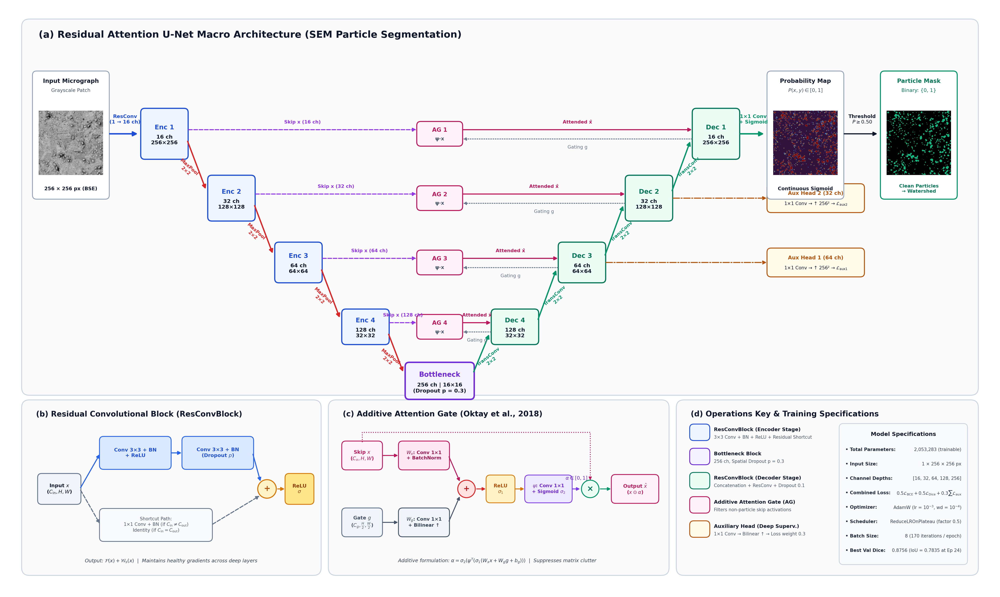

# Superalloy SEM Microstructure Segmentation & Area-Weighted PSD Analysis

[](https://www.python.org/downloads/)
[](https://pytorch.org/)
[](https://opensource.org/licenses/MIT)

A deep learning and stereological characterization pipeline for secondary phase precipitate particles in scanning electron microscopy (SEM) micrographs of metallic superalloys. 

The framework combines a customized **Residual Attention U-Net** with deep supervision, **marker-controlled watershed** instance separation, and stereologically calibrated **area-weighted Particle Size Distribution (PSD)** modeling.

---

## 📌 Architecture Overview



### Key Network Characteristics
* **Contracting Encoder:** 4 resolution stages (16 to 128 channels) with $2 \times 2$ max pooling.
* **Residual Convolutions (ResConvBlock):** Dual $3 \times 3$ convolutions with Batch Normalization, ReLU, and identity/$1\times 1$ projection shortcuts to ensure healthy gradient propagation.
* **Additive Attention Gates (AGs):** Conditioned on coarse decoder features to filter out matrix background noise and imaging scratches along skip pathways prior to concatenation.
* **Deep Supervision:** Intermediate auxiliary prediction heads tapped at decoder levels 2 and 3, driving early semantic alignment.
* **Compact Model Size:** 2,053,283 trainable parameters (optimized for rapid CPU/GPU inference without overfitting small microscopy sets).

---

## 📊 Benchmark Validation Results

Evaluated across full-frame SEM micrographs at 50% sliding-window overlap:

| Metric | Validation Score | Description |
| :--- | :---: | :--- |
| **Dice Coefficient** | **$0.842 \pm 0.071$** | Peak validation Dice: $0.8756$ (Epoch 24) |
| **IoU (Jaccard Index)** | **$0.733 \pm 0.088$** | Peak validation IoU: $0.7835$ |
| **Precision** | **$0.864 \pm 0.065$** | Low false positive detection rate on matrix |
| **Recall** | **$0.822 \pm 0.078$** | High true positive sensitivity on precipitates |
| **Pixel Accuracy** | **$97.1 \pm 1.2\%$** | Overall classification accuracy |
| **Predicted Area Fraction ($A_A$)** | **$10.97 \pm 2.8\%$** | Matches Ground Truth ($11.73 \pm 3.1\%$, Delesse principle) |

---

## 🗂️ Repository Structure

```text
SEM-Microstructure-UNet-PSD/
├── configs/
│   ├── config.yaml              # Hyperparameters, loss weights, and pipeline settings
│   └── calibration.yaml         # Physical scale calibration (nm/pixel) by magnification
├── checkpoints/
│   └── best_model.pth           # Pre-trained Residual Attention U-Net weights
├── figures/
│   ├── unet_architecture.png    # High-resolution 300 DPI architecture diagram
│   └── unet_architecture.pdf    # Vector format for publication
├── src/
│   ├── data/                    # Banner inpainting, patch cropping, augmentations, Dataset
│   ├── models/                  # ResConvBlock, AttentionGate, ResidualAttentionUNet
│   ├── losses/                  # Soft Dice, Combined loss, segmentation metrics
│   ├── engine/                  # Training loop (AdamW + ReduceLROnPlateau) & sliding window
│   ├── postprocess/             # Morphological cleaning & marker-controlled watershed
│   └── analysis/                # Sizing (d_eq), area fraction (A_A), 25 nm PSD, GMM fit
├── scripts/
│   ├── 01_prepare_data.py       # Data preprocessing and patch generation
│   ├── 02_train.py              # Model training routine
│   ├── 03_predict.py            # Sliding-window inference on new micrographs
│   ├── 04_run_watershed.py      # Instance separation for touching particles
│   └── 05_analyze_microstructure.py # Sizing, area-weighted PSD, and dual-axis plots
├── requirements.txt             # Environment dependencies
├── LICENSE                      # MIT License
└── README.md
```

---

## 🚀 Quickstart Guide

### 1. Installation
Clone the repository and install required packages:
```bash
git clone https://github.com/saishivaranjan92-dot/SEM-Microstructure-UNet-PSD.git
cd SEM-Microstructure-UNet-PSD
pip install -r requirements.txt
```

### 2. Prepare Training Patches
Place raw micrographs into `data/raw/` and corresponding masks into `data/masks/`:
```bash
python scripts/01_prepare_data.py --config configs/config.yaml
```

### 3. Train the Model
Train the Residual Attention U-Net:
```bash
python scripts/02_train.py --config configs/config.yaml
```

### 4. Run Sliding-Window Inference
Segment full-frame micrographs using pre-trained or trained weights:
```bash
python scripts/03_predict.py --input data/raw/ --weights checkpoints/best_model.pth
```
Outputs continuous probability maps and binary masks ($P \ge 0.50$) to `outputs/`.

### 5. Separate Touching Particles (Watershed)
Split clustered particle regions into individual instances:
```bash
python scripts/04_run_watershed.py --input outputs/binary_masks/
```

### 6. Metallurgical Sizing & Area-Weighted PSD
Compute equivalent circular diameter ($d_{\text{eq}}$), Delesse area fraction ($A_A$), and 25 nm area-weighted PSD with bimodal Gaussian Mixture Model (GMM) fitting:
```bash
python scripts/05_analyze_microstructure.py --instances outputs/watershed_instances/ --mag 3000x
```
Saves CSV summary tables and dual-axis publication figures to `outputs/psd_results/`.

---

## 🔬 Stereological Methodology

* **Area-Weighted Histogram Parameter:**
  Rather than standard number frequency, the primary histogram metric is the area parameter $Y_k$:
  $$Y_k = A_{\text{bin}, k} \times f_k = \sum_{i \in \text{bin } k} A_i \quad [\mu\text{m}^2]$$
  This directly weights particles by their volume contribution to alloy precipitation strengthening.
* **Boundary Particle Rule:**
  Particles intersecting the micrograph edge are kept for the overall area fraction ($A_A = V_V$) calculation, but are excluded from size, shape, and distribution measurements to avoid bias from artificially truncated cross-sections.

---

## 📜 Scale Calibration Constants

| Magnification | Pixel Scale (nm/px) | Physical Field of View | Primary Purpose |
| :---: | :---: | :---: | :--- |
| **2,000×** | $49.60$ | $\sim 63.5 \times 47.6\,\mu\text{m}$ | Macroscopic clustering & coarse precipitates |
| **3,000×** | $33.07$ | $\sim 42.3 \times 31.7\,\mu\text{m}$ | Representative area-weighted PSD baseline |
| **5,000×** | $19.84$ | $\sim 25.4 \times 19.0\,\mu\text{m}$ | Intermediate precipitate details |
| **20,000×** | $4.96$ | $\sim 6.35 \times 4.76\,\mu\text{m}$ | Nanometric secondary/tertiary phases |

---

## 📄 License
This project is licensed under the MIT License - see the [LICENSE](LICENSE) file for details.
